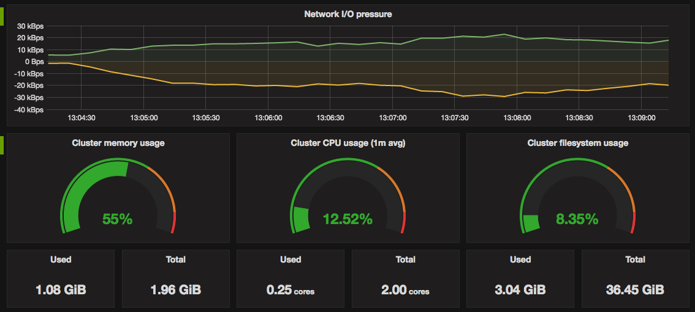

# Microservices Deployment and Monitoring on AWS with EKS, Terraform, and Grafana

## Overview

This project demonstrates my experience in deploying a microservices-based application (the Sock-Shop demo) on AWS using **Amazon EKS (Elastic Kubernetes Service)**. It includes setting up an EKS cluster, deploying microservices, integrating **Prometheus and Grafana** for monitoring, and automating the deployment process with **Terraform** and **GitHub Actions** CI/CD pipeline.

Key steps in the project include:
- Setting up AWS infrastructure using **EKS** and **Terraform**.
- Deploying the Sock-Shop microservices to **EKS**.
- Integrating **Prometheus** and **Grafana** for monitoring and alerting.
- Automating the infrastructure provisioning and deployment with **Terraform** and **GitHub Actions**.

## Technologies Used

- **AWS** (EKS, S3, IAM, VPC)
- **Terraform** (Infrastructure as Code)
- **Kubernetes** (Deployment and orchestration of microservices)
- **Grafana** (Monitoring and Dashboard)
- **Prometheus** (Metrics collection)
- **GitHub Actions** (CI/CD Pipeline)
- **kubectl** (Kubernetes command-line tool)

## Project Steps

### 1. Setting Up Amazon EKS Cluster

The first step was to create a Kubernetes cluster on AWS using the `eksctl` command. Below is the YAML configuration used to define the cluster:

```yaml
apiVersion: eksctl.io/v1alpha5
kind: ClusterConfig

metadata:
  name: sock--shop
  region: eu-north-1

nodeGroups:
  - name: ng-1
    instanceType: t3.medium
    desiredCapacity: 2
  - name: ng-2
    instanceType: t3.medium
    desiredCapacity: 2
```

After applying the configuration, I deployed the EKS cluster with the following commands:

```bash
kubectl apply -f deploy/kubernetes/manifests/
kubectl apply -f deploy/kubernetes/manifests-logging
```


### 2. Setting Up Prometheus and Grafana for Monitoring
To monitor the health and performance of the EKS cluster, I integrated Prometheus and Grafana.

Grafana Dashboards: I used the [Grafana EKS Cluster Prometheus Dashboard](https://grafana.com/grafana/dashboards/315-kubernetes-cluster-monitoring-via-prometheus/) to visualize various metrics from the EKS cluster.



This successfully enabled Prometheus to scrape metrics from the front-end service, and Grafana was configured to update its dashboard with real-time data from Prometheus.

### 3. Automating Infrastructure with Terraform
To further streamline the process, I implemented Terraform for Infrastructure as Code (IaC). Using Terraform, I defined resources such as the VPC, EKS cluster, and IAM roles. The infrastructure was automatically provisioned by Terraform, making it repeatable and scalable (files in `deploy/kubernetes/terraform`)

Terraform configuration for the AWS provider, VPC, and EKS cluster:
```hcl
  eks_managed_node_groups = {
    one = {
      name = "sock-shop-group-1"

      instance_types = ["t3.medium"]

      min_size     = 1
      max_size     = 2
      desired_size = 1
    }

    two = {
      name = "sock-shop-group-2"

      instance_types = ["t3.medium"]

      min_size     = 1
      max_size     = 2
      desired_size = 1

    }
  }

```

### 4. CI/CD Pipeline with GitHub Actions
To ensure a smooth deployment process, I set up a GitHub Actions CI/CD pipeline for automating the provisioning of infrastructure and deployment of the application to EKS. Below is the workflow used for the pipeline:

```yaml
name: Terraform and Deploy to EKS

on:
  push:
    branches:
      - master

jobs:
  terraform:
    name: Terraform
    runs-on: ubuntu-latest

    steps:
      - name: Checkout
        uses: actions/checkout@v3

      - name: Configure AWS Credentials
        uses: aws-actions/configure-aws-credentials@v4
        with:
          aws-access-key-id: ${{ secrets.AWS_ACCESS_KEY_ID }}
          aws-secret-access-key: ${{ secrets.AWS_SECRET_ACCESS_KEY }}
          aws-region: eu-north-1

      - name: Setup kubectl
        uses: azure/setup-kubectl@v4
        with:
          version: 'v1.32.3'

      - name: Install Terraform
        uses: hashicorp/setup-terraform@v3

      - name: Terraform Init
        run: terraform -chdir=deploy/kubernetes/terraform init

      - name: Terraform Plan
        id: plan
        run: terraform -chdir=deploy/kubernetes/terraform plan

      - name: Terraform Apply
        id: apply
        run: terraform -chdir=deploy/kubernetes/terraform apply --auto-approve

      - name: Deploy App
        uses: giovannirossini/aws-eks@v1.0.1
        with:
          aws-access-key-id: ${{ secrets.AWS_ACCESS_KEY_ID }}
          aws-secret-access-key: ${{ secrets.AWS_SECRET_ACCESS_KEY }}
          aws-region: "eu-north-1"
          cluster-name: "sock-shop-cluster"
          command: |
            kubectl apply -f deploy/kubernetes/complete-demo.yaml
```

### 5. State Management and Locking with AWS S3
To manage Terraform's state securely and prevent concurrent modifications, I configured state locking with AWS S3 (files in `deploy/terrafrom_state_locking/terraform`)

Terraform state was stored in an S3 bucket, and DynamoDB was used for state locking to avoid conflicts during deployments:
```hcl

terraform {
  backend "s3" {
    bucket       = "tf-state-bucket-jkosla-eu-north-1"
    key          = "deploy/terraform/terraform.tfstate"
    use_lockfile = true
    region       = "eu-north-1"
  }
}
```

## Conclusion

This project allowed me to showcase my skills in:

- Setting up and managing Kubernetes clusters with AWS EKS.
- Deploying and scaling microservices applications.
- Integrating Prometheus and Grafana for monitoring and real-time observability.
- Automating infrastructure provisioning and application deployment with Terraform and GitHub Actions.

Although, due to time constraints and the high costs associated with cloud resources, I was unable to connect to the machines using the Terraform configuration for public access. It’s likely that I made a mistake in the cloud setup or Terraform configuration, but this provided a great learning opportunity. I gained valuable insights into cloud infrastructure and DevOps practices, and I’m eager to enhance my skills and continue expanding my knowledge to resolve such challenges in the future.


